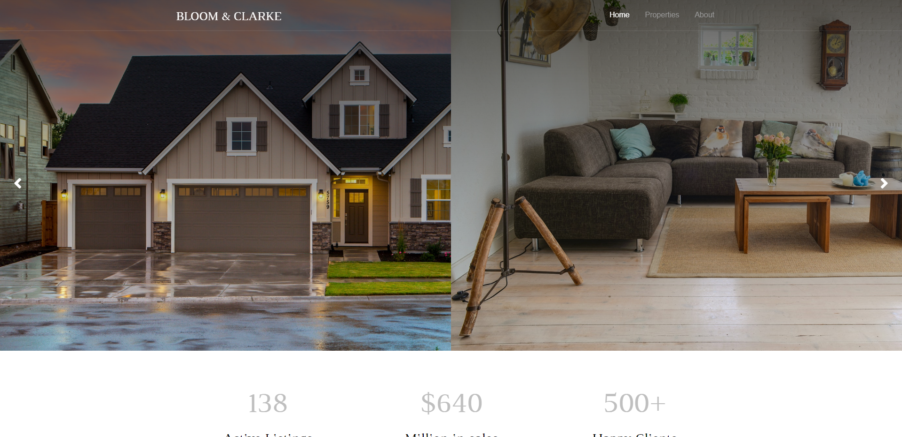
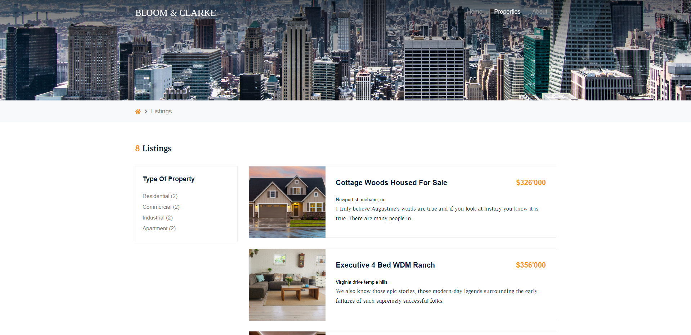
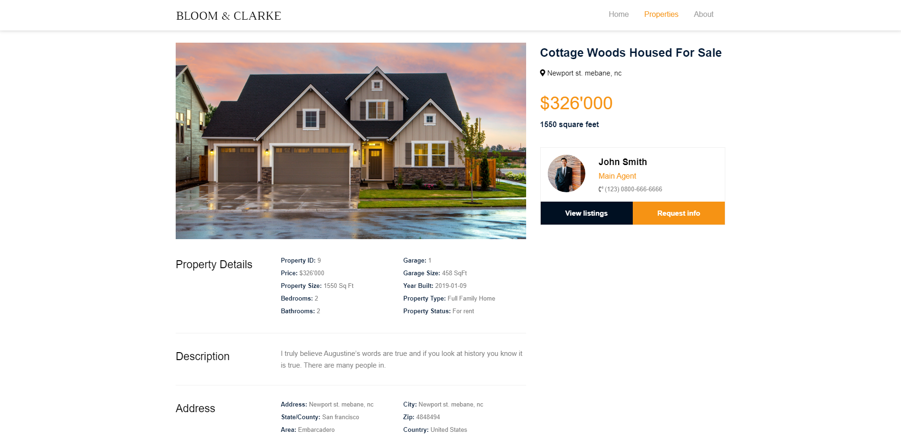

# Bloom & Clarke

Real estate website made with custom MVC framework.

## Prerequisites

* XAMPP
* Composer
* Node Package Manager

## Setup

* Clone this repository on your computer

* Setup local server

* Import realestate.sql table in database manager

* Change the necessary parameters in .env

* Install required npm and composer dependencies

## Pictures

## Author

* **Ričards Lazda** - [Ričards Lazda](https://github.com/ricardslazda)
